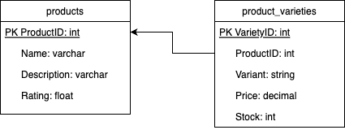

# Products API

Simple Products API Service made in Golang. This service serves product data which includes:

- Basic product data (name, description, rating)
- Product stock and price
- Product variety

## Data Diagram



## API

This backend service serves the functionalities below:

1. Get all products
2. Get product by ID
3. Create new product
4. Update product by ID
5. Delete product by ID

## Requirements

1. [Golang](https://golang.org/doc/install) version 1.19
2. [Docker](https://docs.docker.com/get-docker/) version 20
3. [Docker Compose](https://docs.docker.com/compose/install/) version 1.29
4. [GNU Make](https://www.gnu.org/software/make/)
5. [oapi-codegen](https://github.com/deepmap/oapi-codegen)

   Install the latest version:

   ```
   go install github.com/deepmap/oapi-codegen/cmd/oapi-codegen@latest
   ```

6. [mock](https://github.com/golang/mock)

   Install the latest version:

   ```
   go install github.com/golang/mock/mockgen@latest
   ```

## How to Build

Execute this command to start building:

```
make init
```

## How to Run

Run the project with:

```
docker-compose up --build
```

You should be able to access the API at http://localhost:8080

If you change `database.sql` file, you need to reinitate the database by running:

```
docker-compose down --volumes
```

## Testing

To run test, run the following command:

```
make test
```

## API Contract

Please find the contract in the [Postman Collection](Products-API.postman_collection.json)

## Author

Erma Safira Nurmasyita

erma.safira.n@gmail.com
